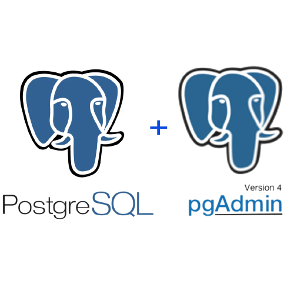
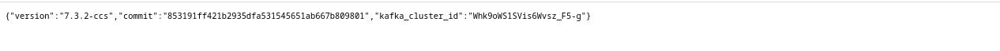
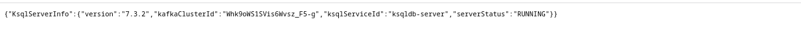
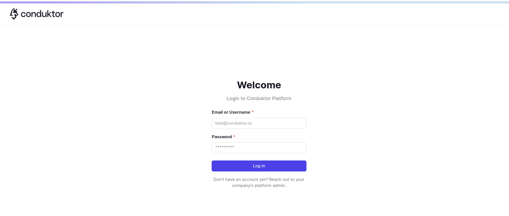
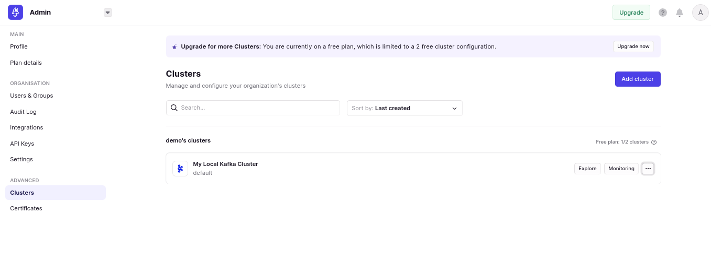
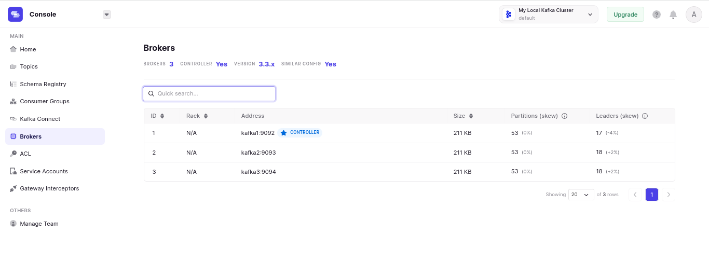
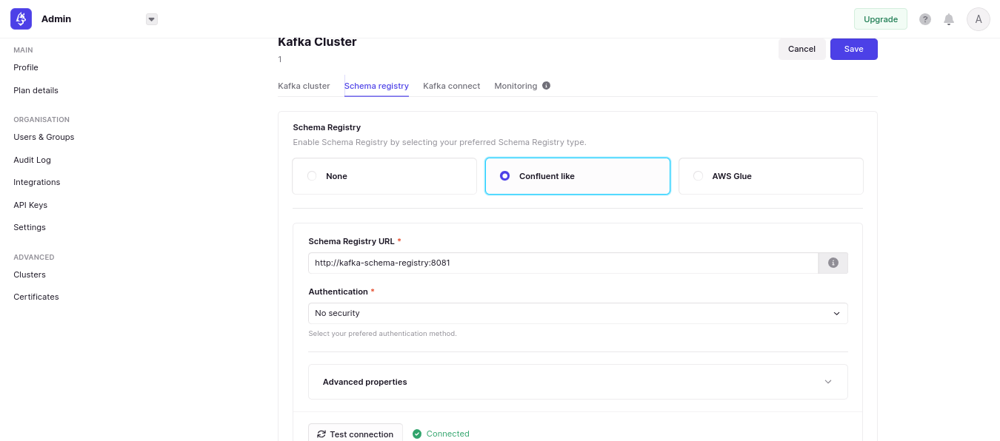
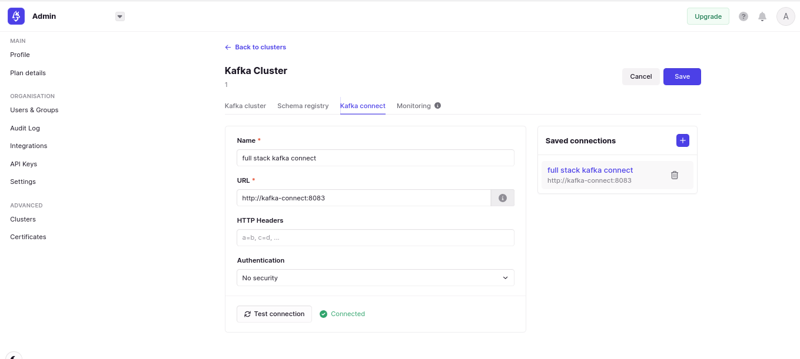
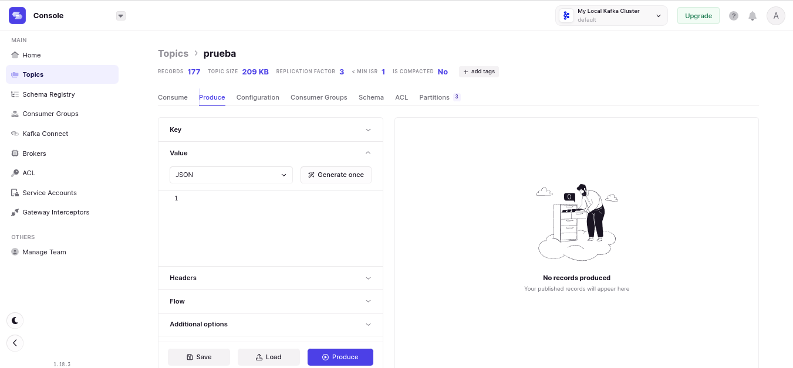
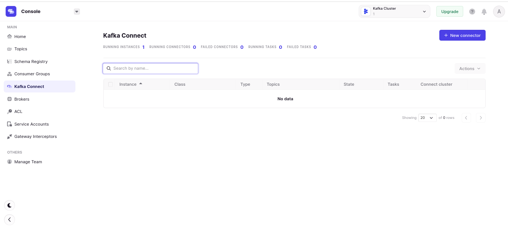

<p align="center">
<a href="https://kafka.apache.org/" target="_blank"></a>
<a href="https://docs.confluent.io/platform/current/connect/index.html" target="_blank"></a>
<a href="https://ksqldb.io/" target="_blank"></a>
<a href="https://docs.confluent.io/platform/current/schema-registry/index.html" target="_blank"></a>
<a href="https://www.conduktor.io/" target="_blank"></a>
<a href="https://www.postgresql.org/" target="_blank"></a>
</p>

# Apache kafka Stack Tools

Basic `Cluster` and `Brokers` Environment Configuration for <a href="https://kafka.apache.org/" target="blank">Apache kafka</a>, **Kafka Connect**, **Kafka Schema Registry**, **ksqlDB-server**, **Kafka REST Proxy**, **Conduktor**, **PostgreSQL**, and **pgAdmin** in **Docker** containers.

## Description

<p align="center">Configuration of Cluster and Brokers in Apache Kafka with connection to <a href="https://docs.confluent.io/platform/current/connect/index.html" target="blank">kafka Connect</a>, <a href="https://docs.confluent.io/platform/current/schema-registry/index.html" target="blank">kafka-schema-registry</a>, <a href="https://ksqldb.io/" target="_blank">ksqlDB</a>, <a href="https://docs.confluent.io/platform/current/kafka-rest/index.html" target="blank">kafka REST Proxy</a>, <a href="https://www.conduktor.io/" target="blank">Conduktor</a>, <a href="https://www.postgresql.org/" target="blank">PostgreSql</a> and <a href="https://www.postgresql.org/" target="blank">PgAdmin 4</a> in <a href="https://docs.docker.com/compose/" target="blank">Docker</a> containers.</p>

## Requirements

Make sure you have the latest versions of **Docker** and **Docker Compose** installed on your machine.

Clone this repository or copy the files from this repository into a new folder. In the `docker-compose.yml` files, you can change the ports (if you are running multiple containers on your system).

With this project, you can quickly execute the following:

- [Apache Kafka](https://hub.docker.com/r/confluentinc/cp-kafka)
- [kafka connect](https://hub.docker.com/r/confluentinc/cp-kafka-connect)
- [kafka-schema-registry](https://hub.docker.com/r/confluentinc/cp-schema-registry)
- [ksqldb](https://hub.docker.com/r/confluentinc/cp-ksqldb-server)
- [kafka-rest-proxy](https://hub.docker.com/r/confluentinc/cp-kafka-rest)
- [Conduktor](https://hub.docker.com/r/conduktor/conduktor-platform)
- [Postgresql](https://hub.docker.com/_/postgres)
- [PgAdmin](https://hub.docker.com/r/dpage/pgadmin4)

Contenido:

- [Apache kafka Stack Tools](#apache-kafka-stack-tools)
  - [Description](#description)
  - [Requirements](#requirements)
  - [Configuration](#configuration)
  - [Installation](#installation)
  - [Use](#use)
    - [Services](#services)
    - [Conduktor](#conduktor)
  - [Licencia](#licencia)


## Configuration

Edit the `.env` file to change the default environment variables.
## Installation

Open a terminal and run `cd` to the folder where you can see the files `docker-compose-kafka-single-stack.yml`, which contains the necessary configuration to deploy a Kafka broker, and the file `docker-compose-kafka-multiple-stack.yml`, which contains the configuration for multiple **Apache Kafka** **brokers**.

Execute as needed:

```
docker-compose -f docker-compose-kafka-single-stack.yml up -d  
```

This will start the containers and create the volumes according to the configuration in your `docker-compose.yml` files. **Make sure to grant write permissions to the directory** so it can create the necessary volumes for the containers.

* `.env` – File containing the environment variable data.
* `volumenes` – Folder containing container data.

The containers are already built and running. You should be able to access the installation of each container.

## Use

### Services

You can visit `http:/localhost:8083` to check the status of **kafka-connect**, or go to` http:/localhost:8088` to view the status of **ksqldb-server**, as well as the other services such as **kafka-rest-proxy** and **kafka-schema-registry**.


<a href="https://github.com/ali-ramirez/kafka-stack" rel="noreferrer">
<p style="text-align: center;"></p>
</a>
<a href="https://github.com/ali-ramirez/kafka-stack" rel="noreferrer">
<p style="text-align: center;"></p>
</a>

### Conduktor 

ou can visit `http:/localhost:8080` to access **Conduktor**. The default username is **admin@admin.io**, and the password is **admin**. You can modify these credentials in the environment variables located in the `.env` file."

<a href="https://github.com/ali-ramirez/kafka-stack" rel="noreferrer">
<p style="text-align: center;"></p>
</a>

The **Conduktor** tool will allow you to view the status of the `cluster` as well as visualize the `brokers` you have deployed in **Apache Kafka**.

<a href="https://github.com/ali-ramirez/kafka-stack" rel="noreferrer">
<p style="text-align: center;"></p>
</a>

<a href="https://github.com/ali-ramirez/kafka-stack" rel="noreferrer">
<p style="text-align: center;"></p>
</a>

In the **Conduktor** interface, you will be able to see the status of the connection with your configured and connected services, such as **kafka-connect** and **kafka-schema-registry** to **Apache Kafka**.

<a href="https://github.com/ali-ramirez/kafka-stack" rel="noreferrer">
<p style="text-align: center;"></p>
</a>

<a href="https://github.com/ali-ramirez/kafka-stack" rel="noreferrer">
<p style="text-align: center;"></p>
</a>

**Conduktor** will be useful for conducting the necessary tests and visual management of **Apache Kafka**. You can create new `topics` and send/receive `messages` as well.

<a href="https://github.com/ali-ramirez/kafka-stack" rel="noreferrer">
<p style="text-align: center;"></p>
</a>

From the **Conduktor** interface, you can create connectors and schemas, manage them, and test them visually.

<a href="https://github.com/ali-ramirez/kafka-stack" rel="noreferrer">
<p style="text-align: center;"></p>
</a>

## Licencia

[](http://creativecommons.org/publicdomain/zero/1.0)