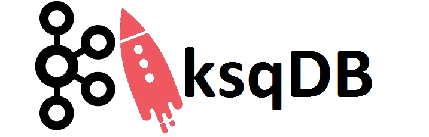

<p align="center">
<a href="https://kafka.apache.org/" target="_blank"></a>
<a href="https://docs.confluent.io/platform/current/connect/index.html" target="_blank"></a>
<a href="https://ksqldb.io/" target="_blank"></a>
<a href="https://docs.confluent.io/platform/current/schema-registry/index.html" target="_blank"></a>
<a href="https://www.conduktor.io/" target="_blank"></a>
<a href="https://www.postgresql.org/" target="_blank"></a>
</p>

# Apache kafka Stack Tools

Entorno básico Configuración Cluster y Brokers , **kafka connect**, **kafka-schema-registry**, **ksqldb**, **kafka-rest-proxy**, **Conduktor**, **PostgreSql y PgAdmin**  para <a href="https://kafka.apache.org/" target="blank">Apache kafka</a>.

## Descripción

<p align="center">Configuración Cluster y brokers de <a href="https://kafka.apache.org/" target="blank">Apache kafka</a> conexión a <a href="https://docs.confluent.io/platform/current/connect/index.html" target="blank">kafka Connect</a>, <a href="https://docs.confluent.io/platform/current/schema-registry/index.html" target="blank">kafka-schema-registry</a>,
<a href="https://ksqldb.io/" target="blank">ksqldb</a>, 
<a href="https://docs.confluent.io/platform/current/kafka-rest/index.html" target="blank">kafka REST Proxy</a> y <a href="https://www.conduktor.io/" target="blank">Conduktor</a> en contenedores <a href="https://docs.docker.com/compose/" target="blank">Docker</a>.</p>


## Requerimientos

Asegúrese de tener las últimas versiones de **Docker** y **Docker Compose** instaladas en su máquina.

Clona este repositorio o copia los archivos de este repositorio en una nueva carpeta. En los  `docker-compose.yml`archivos puede cambiar los puertos (en caso de que ejecute varios contenedores en su sistema).

Con este proyecto puedes ejecutar rápidamente lo siguiente:

- [Apache Kafka](https://hub.docker.com/r/confluentinc/cp-kafka)
- [kafka connect](https://hub.docker.com/r/confluentinc/cp-kafka-connect)
- [kafka-schema-registry](https://hub.docker.com/r/confluentinc/cp-schema-registry)
- [ksqldb](https://hub.docker.com/r/confluentinc/cp-ksqldb-server)
- [kafka-rest-proxy](https://hub.docker.com/r/confluentinc/cp-kafka-rest)
- [Conduktor](https://hub.docker.com/r/conduktor/conduktor-platform)
- [Postgresql](https://hub.docker.com/_/postgres)
- [PgAdmin](https://hub.docker.com/r/dpage/pgadmin4)

Contenido:

- [Apache kafka Stack Tools](#apache-kafka-stack-tools)
  - [Descripción](#descripción)
  - [Requerimientos](#requerimientos)
  - [Configuración](#configuración)
  - [Instalación](#instalación)
  - [Uso](#uso)
    - [Servicios](#servicios)
    - [Conduktor](#conduktor)
  - [Licencia](#licencia)


## Configuración

Edite el `.env` archivo para cambiar las variables de entorno predeterminadas.

## Instalación

Abra una terminal y ejecute `cd` hacia la carpeta en la que podrá ver los archivos  `docker-compose-kafka-single-stack.yml` que contiene la configuración necesaria para desplegar un broker de kafka y el archivo `docker-compose-kafka-multiple-stack.yml` que contiene la configuración para multiples broker de apache kafka.

según su necesidad ejecute:

```
docker-compose -f docker-compose--kafka-single-stack.yml up -d  
```

Esto pondrá en funcionamiento los contenedores y creara los volúmenes según configuración de sus `docker-compose.yml` archivos, **asegúrese de darle los permisos de escritura al directorio** para que pueda crear los `volumenes` necesarios de los container sin inconveniente alguno.

* `.env` – archivo que contiene los datos de las variables de entorno.
* `volumenes` – Carpeta que contiene los datos de los contenedores.

Los contenedores ya están levantados y en funcionamiento. Debería poder acceder a la instalación de cada contenedor.

## Uso

### Servicios

Puede Visitar `http:/localhost:8083` para ver el status de **kafka-connect** o visitar `http:/localhost:8088` y vera el estatus de **ksqldb-server** al igual que los demas servicios **kafka-rest-proxy** y **kafka-schema-registry**.

<a href="https://github.com/ali-ramirez/kafka-stack" rel="noreferrer">
<p style="text-align: center;"></p>
</a>
<a href="https://github.com/ali-ramirez/kafka-stack" rel="noreferrer">
<p style="text-align: center;"></p>
</a>

### Conduktor 

Puede Visitar `http:/localhost:8080` para acceder a **Conduktor**
El nombre de usuario predeterminado es **admin@admin.io**, el password es **admin** las credenciales puede modificarlas en las variables de entorno que se encuentran en el `.env` archivo.

<a href="https://github.com/ali-ramirez/kafka-stack" rel="noreferrer">
<p style="text-align: center;"></p>
</a>

La herramienta **Conduktor** le permitirá ver el estatus del `cluster` como también visualizar los `brokers` que tenga desplegados de **Apache Kafka**.

<a href="https://github.com/ali-ramirez/kafka-stack" rel="noreferrer">
<p style="text-align: center;"></p>
</a>

<a href="https://github.com/ali-ramirez/kafka-stack" rel="noreferrer">
<p style="text-align: center;"></p>
</a>

En la Interfaz de **Conduktor** podra visualizar el estatus de la conexión con sus servicios  `kafka-connect`, `kafka-schema-registry`  configurados y conectados al **Apache Kafka**.

<a href="https://github.com/ali-ramirez/kafka-stack" rel="noreferrer">
<p style="text-align: center;"></p>
</a>

<a href="https://github.com/ali-ramirez/kafka-stack" rel="noreferrer">
<p style="text-align: center;"></p>
</a>

**Conduktor** le sera util para realizar las pruebas necesarias y administración de  **Apache Kafka** de forma visual,  podrá crear nuevos topic,  como también enviar y consumir mensajes.

<a href="https://github.com/ali-ramirez/kafka-stack" rel="noreferrer">
<p style="text-align: center;"></p>
</a>

Desde la Interfaz de **Conduktor** podrá crear conectores o esquemas y podrá administrarlos y probarlos de una forma visual.

<a href="https://github.com/ali-ramirez/kafka-stack" rel="noreferrer">
<p style="text-align: center;"></p>
</a>

## Licencia

[](http://creativecommons.org/publicdomain/zero/1.0)